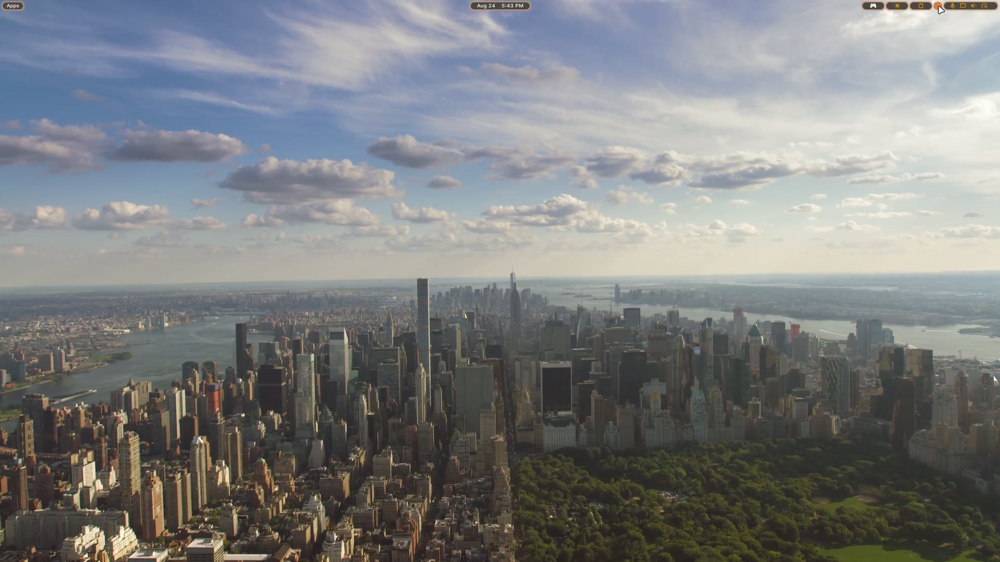
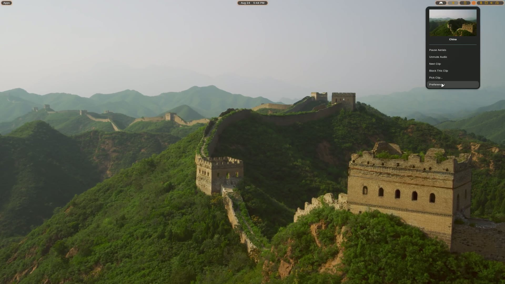
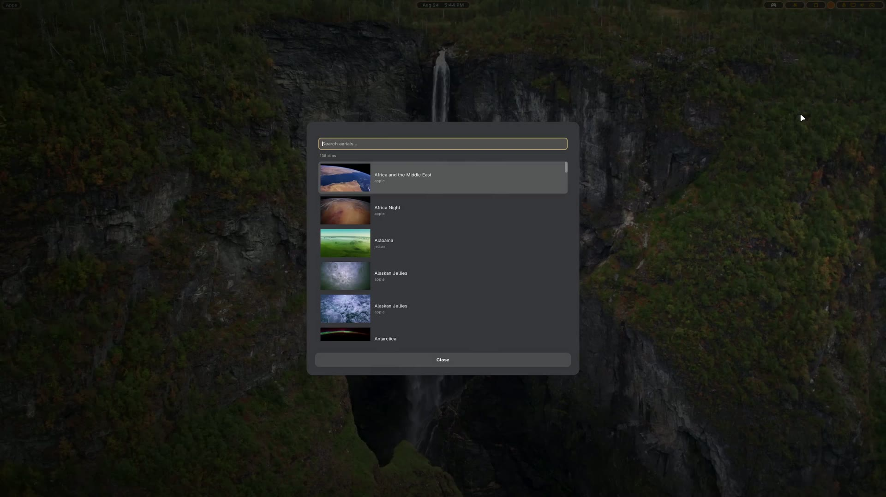
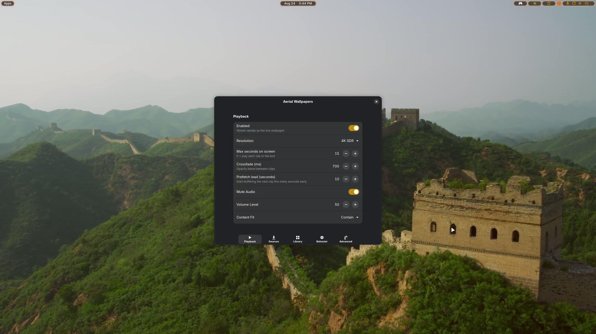

# Aerial Wallpapers

Turn your GNOME desktop into a window onto the world. This extension streams the
same aerial videos Apple ships as tvOS screensavers — drone footage of coastlines,
cities, deserts and the Earth from orbit — and plays them as your live wallpaper,
shuffling to a new location every few minutes.

Clips are streamed straight from their original CDNs and crossfaded on the GPU, so
there is no local proxy or helper service to install, no video is ever written to
disk, and there is no black gap between one clip and the next.
When you maximize a window, unplug the charger, or lock the screen, playback pauses
and gets out of the way.

**GNOME Shell 50 · Wayland · GPL-3.0-or-later**



Shuffling locations, with one clip crossfading into the next:

https://github.com/user-attachments/assets/687e8eb4-1722-4b60-ae7d-faa5b2bc70f0

Forked from [Hanabi](https://github.com/jeffshee/gnome-ext-hanabi) by Jeff Shee and
contributors; see [NOTICE](NOTICE) for full attribution.

## Features

- **Gapless shuffle.** Two decode pipelines run side by side: the next clip is
  pre-rolled a few seconds early, then the two are crossfaded, so transitions never
  drop to black.
- **Direct streaming.** Manifests and video are fetched from the upstream CDNs. No
  proxy, no systemd unit, no downloaded video library.
- **Three built-in catalogs.** Apple's tvOS aerials plus the Jetson Creative and
  Robin Fourcade community collections — about 140 locations, each available in 4K
  HEVC, 1080p HEVC, and 1080p H.264.
- **Clip picker.** Press <kbd>Super</kbd>+<kbd>W</kbd> for a searchable, thumbnailed
  list; arrow keys and <kbd>Enter</kbd> to switch wallpaper instantly.
- **Panel menu.** Shows a preview and the name of the current location, with pause,
  mute, skip, and block controls.
- **Blocklist.** Don't like a clip? Block it from the panel menu, or click its
  thumbnail on the Library page in preferences.
- **Custom feeds.** Point the extension at your own JSON manifest to add clips.
- **Battery- and window-aware.** Pauses on maximized or fullscreen windows, on
  battery, on low battery, or while another app is playing media — all optional.
- **Lock screen and overview.** Keeps playing behind the lock screen and in the
  workspace overview, with configurable rounded corners.

## Requirements

- GNOME Shell **50** on **Wayland**
- GStreamer with `gtk4paintablesink`, `souphttpsrc`, and **HEVC (H.265) decode**.
  Hardware decoding via VA-API is strongly recommended — 4K HEVC on the CPU will
  cost you a core or two. Set video quality to *1080p H.264* if your machine has no
  HEVC decoder.
- Network access to `raw.githubusercontent.com` (manifests), `sylvan.apple.com`
  (Apple video), `github.com` (community video), and `aerial-videos.netlify.app`
  (thumbnails).

Installing codecs:

```bash
# Fedora
sudo dnf group install multimedia
# Ubuntu / Debian
sudo apt install gstreamer1.0-plugins-good gstreamer1.0-plugins-bad gstreamer1.0-vaapi
# openSUSE Tumbleweed
sudo zypper install gstreamer-plugins-good gstreamer-plugins-bad gstreamer-plugins-vaapi
```

Verify the pieces the extension needs are present:

```bash
gst-inspect-1.0 gtk4paintablesink >/dev/null && echo "video sink OK"
gst-inspect-1.0 | grep -iE 'vah265|nvh265|h265' | head
```

## Install

### From a release zip (recommended)

```bash
gnome-extensions install --force aerial-wallpapers@michael-d-murray.com.shell-extension.zip
```

Then **log out and back in** — on Wayland, GNOME Shell only discovers newly added
extension UUIDs when the session starts. Afterwards:

```bash
gnome-extensions enable aerial-wallpapers@michael-d-murray.com
```

### From source

```bash
git clone https://github.com/mdomm418-lgtm/aerial-wallpapers
cd aerial-wallpapers
npm install
make install     # builds with esbuild, installs via meson into ~/.local
```

Log out and back in, then `make enable`. Build dependencies: `node`, `npm`,
`meson`, `ninja`, `gettext`, and `glib-compile-schemas`.

To produce the same zip the release workflow publishes, run `make pack`; it lands
in `dist/`.

### Uninstall

```bash
make uninstall   # or: gnome-extensions uninstall aerial-wallpapers@michael-d-murray.com
```

## Using it

Picking a clip from the shortcut, then working through the settings:

https://github.com/user-attachments/assets/121cc41f-093e-4edd-87a8-8033fe108773

Open the panel menu from the aerial icon in the top bar for the current clip's
preview and name, plus *Pause Aerials*, *Mute Audio*, *Next Clip*,
*Block This Clip*, *Pick Clip…*, and *Preferences*.



Press <kbd>Super</kbd>+<kbd>W</kbd> (rebindable) to open the picker. Type to filter,
navigate with <kbd>↑</kbd>/<kbd>↓</kbd>, <kbd>Page Up</kbd>/<kbd>Page Down</kbd>,
<kbd>Home</kbd>/<kbd>End</kbd>, choose with <kbd>Enter</kbd>, dismiss with
<kbd>Esc</kbd>. Picking a clip crossfades to it immediately; the shuffle carries on from
there.



Preferences (`gnome-extensions prefs aerial-wallpapers@michael-d-murray.com`) is
organised as:

| Page | What's there |
|------|--------------|
| **Playback** | Enable, resolution, max seconds on screen, crossfade duration, prefetch lead, mute and volume, content fit |
| **Sources** | Built-in catalog toggles, custom feeds, refresh interval and manual refresh |
| **Library** | Every clip as a thumbnail grid; click to block or restore |
| **Behavior** | Auto-pause rules, panel menu, lock screen, overview corner radius, picker shortcut |
| **Advanced** | VA-API and NVIDIA decoders, TLS host exceptions, graphics offload, startup delay, debug logging |



### How clips are chosen

Clips are drawn from a shuffled deck of every enabled, non-blocked clip that has a
video URL at your chosen quality, so you see each location once before any repeats.
A clip is swapped when it ends or after **Max seconds on screen** (default 180), whichever
comes first; set that to `0` to always play clips to the end. Advancing is driven by
playback position rather than a wall clock, so a paused wallpaper holds its clip
instead of silently shuffling behind a maximized window.

## Custom feeds

Add your own manifest under **Preferences → Sources → Add custom feed**: give it a
name, paste the manifest URL, and press *Add*. The feed is enabled immediately and
its clips join the shuffle on the next refresh; reopen preferences to see it listed
under Sources and its clips on the Library page.

A manifest is JSON — either a bare array of clip objects, or an object with an
`assets` array:

```json
{
  "assets": [
    {
      "id": "a1b2c3d4-0000-4444-8888-abcdefabcdef",
      "accessibilityLabel": "Sognefjord, Norway",
      "url-4K-SDR": "https://example.com/sognefjord-4k.mov",
      "url-1080-SDR": "https://example.com/sognefjord-1080.mov",
      "url-1080-H264": "https://example.com/sognefjord-1080-h264.mov",
      "previewImage": "https://example.com/sognefjord.jpg",
      "includeInShuffle": true
    }
  ]
}
```

| Field | Required | Notes |
|-------|----------|-------|
| `id` | yes | Any stable unique string. Used for blocklisting and thumbnail caching; clips reusing an id are de-duplicated |
| `url-4K-SDR` / `url-1080-SDR` / `url-1080-H264` | at least one | Must match the quality selected in preferences, otherwise the clip is skipped. Any container GStreamer can demux works |
| `accessibilityLabel` or `title` | recommended | Shown in the picker and panel menu; falls back to the id |
| `previewImage` | optional | Used only if no thumbnail exists for the id upstream |
| `includeInShuffle` | optional | `false` excludes the clip entirely |

Manifests are fetched over HTTPS with strict certificate verification and are only
ever parsed as JSON — never evaluated. `ETag`/`If-None-Match` is honoured, so
refreshes are cheap. Feeds are re-fetched on the **Refresh interval** set on the
Sources page (default 24 hours), or on demand with *Refresh manifests now*.

Prefer editing settings directly? Feeds live in one GSettings key as a JSON array of
`{id, name, url, file, enabled}` objects, and a feed's `id` must also be listed in
`catalogs` for it to play:

```bash
EXT=~/.local/share/gnome-shell/extensions/aerial-wallpapers@michael-d-murray.com
gsettings --schemadir "$EXT/schemas" get com.michael-d-murray.aerial-wallpapers custom-feeds
```

## Files and identifiers

| Kind | Value |
|------|-------|
| UUID | `aerial-wallpapers@michael-d-murray.com` |
| GSettings schema | `com.michael-d-murray.aerial-wallpapers` |
| Renderer D-Bus name | `com.michaeldmurray.AerialWallpapers` |
| Cached manifests | `~/.local/share/aerial-wallpapers@michael-d-murray.com/feeds/` |
| Cached thumbnails | `~/.cache/aerial-wallpapers@michael-d-murray.com/thumbnails/` |

Nothing else is written to disk; video is never cached locally. Deleting those two
directories is harmless — they are rebuilt on the next run.

## Troubleshooting

**Nothing happens after installing.** On Wayland a new extension UUID is only picked
up at session start. Log out and back in, then enable it. The same applies after
changing extension code: `disable`/`enable` will not reload it, because GNOME Shell
caches extension modules for the life of the session.

**Black wallpaper, no video.** Check the video sink exists
(`gst-inspect-1.0 gtk4paintablesink`) and watch the renderer's own log:

```bash
journalctl -f -o cat | grep Aerial
```

**Stuttering or high CPU.** You are probably decoding 4K HEVC in software. Enable
*Experimental VA Plugin* on the Advanced page, or drop to *1080p H.264* on the
Playback page.

**Clips never change.** Auto-pause is likely holding a clip — that is deliberate.
Check the *Behavior* page, or *Pause Aerials* in the panel menu.

## TLS note

`sylvan.apple.com`, the CDN hosting Apple's aerials, serves an incomplete
certificate chain, so strict verification fails. The renderer therefore disables
`ssl-strict` on the GStreamer HTTP source **only** for hosts listed in the
`tls-insecure-hosts` setting (default: that one host). Manifest and thumbnail
downloads always use strict verification, and you can empty the list to opt out at
the cost of losing the Apple catalog.

Because GJS cannot safely be called from a GStreamer streaming thread, the source
element is configured by polling the pipeline from the main loop rather than from a
`source-setup` callback.

## Development

See [docs/dev.md](docs/dev.md) for build targets, the release process, and notes on
the renderer architecture.

## License

GPL-3.0-or-later. Contains code from Hanabi © Jeff Shee and contributors.

Video and thumbnail content belongs to its respective owners; this extension only
streams the publicly published manifests catalogued by
[AerialVideos](https://github.com/theothernt/AerialVideos).
